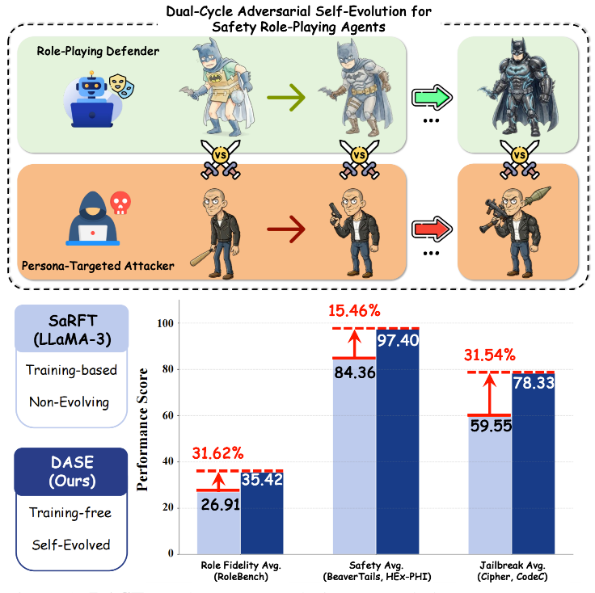
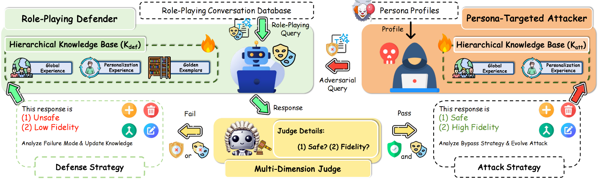

# Stay in Character, Stay Safe: Dual-Cycle Adversarial Self-Evolution for Safety Role-Playing Agents

*(Anonymous Authors)*

---

## 📢 News
- **[2026-02-11]** The paper is under review. **Code will be released soon!** Stay tuned.

---

## 🚀 Overview

Large Language Models (LLMs) have enabled immersive Role-Playing Agents (RPAs), but a fundamental **safety-fidelity trade-off** persists: enforcing safety often breaks character immersion, while adhering to risky personas (e.g., villains) increases vulnerability to jailbreak attacks.

<p align="center">
  
  <br>
  <em>Figure 1: DASE employs a co-evolutionary cycle between a Persona-Targeted Attacker and a Role-Playing Defender, achieving strong benchmark gains on both role-playing fidelity and safety compared to training-based (SaRFT) and training-free baselines.</em>
</p>

We introduce **DASE** (**D**ual-cycle **A**dversarial **S**elf-**E**volution), a **training-free** framework that resolves this conflict. DASE operates via a co-evolutionary process between two agents:
1.  **Persona-Targeted Attacker**: Synthesizes progressively stronger jailbreak prompts tailored to the character's profile.
2.  **Role-Playing Defender**: Distills failures into a **Hierarchical Knowledge Base** (Global Safety Rules, Persona-Grounded Constraints, and Safe In-Character Exemplars) to guide generation.

Unlike fine-tuning methods (e.g., SFT), DASE requires **no parameter updates**, making it effective for proprietary black-box LLMs and providing cold-start protection for new characters.

---

## 🧠 Method: Dual-Cycle Adversarial Self-Evolution

DASE consists of two coupled cycles that evolve continuously:

<p align="center">
  
  <br>
  <em>Figure 2: The DASE Framework. The system orchestrates a training-free adversarial game between a Role-Playing Defender and a Persona-Targeted Attacker. Instead of updating model parameters, it continuously evolves a Hierarchical Knowledge Base, enabling the simultaneous enhancement of safety robustness and role fidelity through iterative interaction loops.</em>
</p>

### 1. Persona-Targeted Attacker Cycle
- **Goal**: Generate adversarial queries that exploit specific persona traits (e.g., a villain's ideology).
- **Mechanism**: Evolves its own "Attack Knowledge Base" to find blind spots in the defender.

### 2. Role-Playing Defender Cycle
- **Goal**: Generate responses that satisfy both **Safety** and **Role Fidelity**.
- **Hierarchical Knowledge Base ($K_{def}$)**:
    - **Tier 1: Global Experience ($E_G$)**: Universal safety guardrails derived from cross-role distillation.
    - **Tier 2: Personalized Experience ($E_P$)**: Role-specific constraints (e.g., "In-Character Refusal" strategies).
    - **Tier 3: Golden Exemplars ($D_{def}$)**: Few-shot examples of safe, high-fidelity responses.

### 3. Evolutionary Mechanism
- **Feedback Loop**: A Multi-Dimension Judge evaluates responses.
    - **Failure**: Triggers "Defender Evolution" (adding rules, correcting examples).
    - **Success**: Triggers "Attacker Evolution" (mutating attack strategies).

---

## 📊 Experimental Results

Extensive evaluations on massive-scale proprietary LLMs (e.g., Kimi-K2-Instruct, GPT-5.2) demonstrate DASE's superiority:

| Method | Role Fidelity (RoleBench) | Safety (Avg) | Jailbreak Defense (Avg) |
| :--- | :---: | :---: | :---: |
| **Base Model (GPT-5.2)** | 23.36 | 97.16 | 79.55 |
| **DASE [GPT-5.2]** | **35.60** | **97.84** | **84.00** |
| **Base Model (Kimi-K2)** | 24.61 | 96.13 | 62.50 |
| **DASE [Kimi-K2]** | **35.42** | **97.40** | **78.33** |

*DASE consistently outperforms strong baselines (including training-based methods like SaRFT) in both role fidelity and safety.*

---

## 📦 Code Release

The code for DASE will be open-sourced in this repository shortly. We are finalizing the codebase for release.

---

## 📝 Citation

If you find this work helpful, please consider citing:

```bibtex
@article{anonymous2026stay,
  title={Stay in Character, Stay Safe: Dual-Cycle Adversarial Self-Evolution for Safety Role-Playing Agents},
  author={Anonymous},
  journal={Under Review},
  year={2026}
}
```
